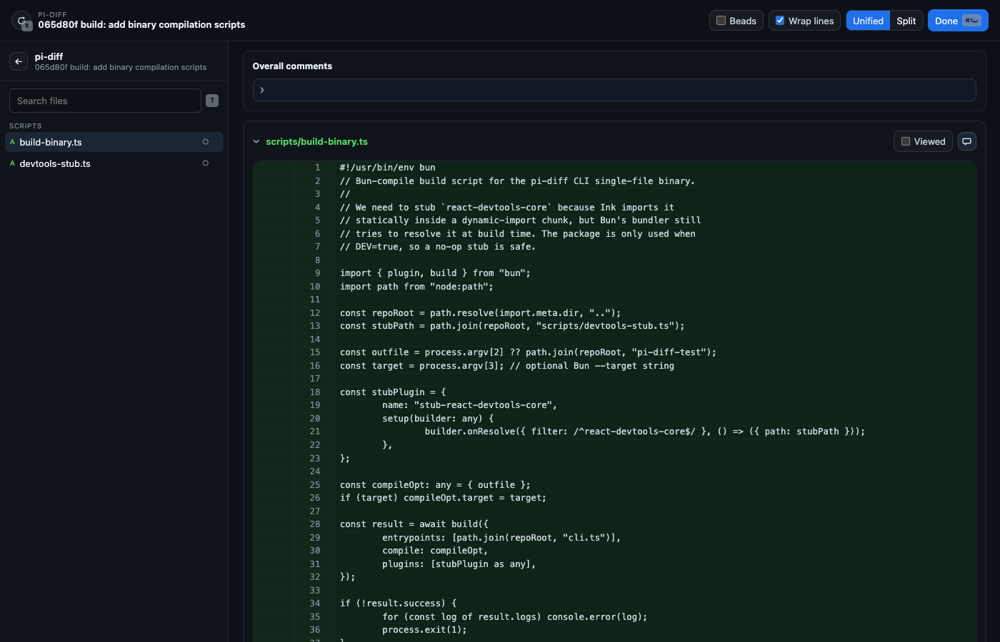
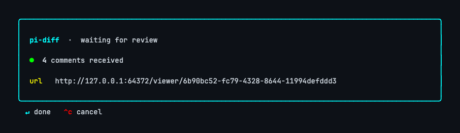
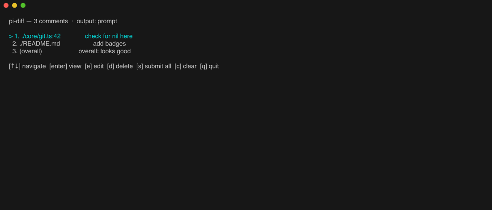

# pi-diff

> GitHub-style diff review for the terminal. Open any diff (uncommitted / branch / commit) in a real browser, comment line-by-line, then dump the feedback into your prompt or turn each comment into a [beads](https://github.com/gastownhall/beads) task — all from one binary.

Same code ships two ways:

- **Standalone CLI** (`pi-diff`) — Bun-compiled single binary, no Node required.
- **pi extension** — registers `/diff`, `/diff-settings`, `/diff-backups` inside [pi](https://github.com/earendil-works/pi-coding-agent).

---

## Screenshots

### 1. Browser viewer — line/file/overall comments, unified/split, search, sidebar



### 2. CLI Phase A — live counter while comments stream in from the browser



### 3. CLI Phase B — Ink-based TUI manager: navigate, edit, delete, submit



---

## Install

### Single binary (recommended)

```bash
curl -fsSL https://raw.githubusercontent.com/yurifrl/pi-diff/main/install.sh | bash
# or pin a version:
curl -fsSL https://raw.githubusercontent.com/yurifrl/pi-diff/main/install.sh | bash -s -- --version v0.1.0
```

The script auto-detects `darwin`/`linux` × `arm64`/`x64`, downloads the matching binary from [Releases](https://github.com/yurifrl/pi-diff/releases), verifies its `.sha256`, and drops it in `/usr/local/bin` (or `~/.local/bin` if you don't have sudo). Manual download from the releases page works too.

### From source

This repo uses [Task](https://taskfile.dev) (`brew install go-task`).

```bash
git clone https://github.com/yurifrl/pi-diff.git
cd pi-diff
task install         # npm install
task build           # web bundle + tsc
task test            # vitest (93 tests)
task build:binary    # bun-compiled single-file binary at ./pi-diff
task install:local   # copies the binary into ~/.local/bin
```

`task --list` shows everything available. `task dev -- <args>` runs the CLI from source via `tsx` with no rebuild.

---

## Quickstart (CLI)

```bash
pi-diff                              # interactive target picker
pi-diff uncommitted                  # working tree vs HEAD
pi-diff branch main                  # merge-base of main vs HEAD
pi-diff commit abc123                # commit vs its parent
pi-diff commit abc123 --output beads # one-off override
pi-diff serve                        # persistent server; later diffs become tabs
pi-diff uncommitted --name "Fix" --bead bd-12  # register a PR tab on a running server
```

The flow:

1. Pick a target (or pass it on the CLI).
2. CLI starts a localhost HTTP server, opens the viewer (`cmux` pane / system browser / nothing — your choice).
3. **Comment in the browser.** Click any line, write feedback, send. Submit as many batches as you like — the CLI counter ticks up live.
4. **Click `Done`** in the viewer (or just close the tab — `beforeunload` is wired). The CLI flips to the manager.
5. **In the terminal:** `↑↓` to navigate, `enter` to view, `e` to edit (opens `$EDITOR`), `d` to delete, `s` to submit all, `q` to quit.

Output depends on `--output` (default: `prompt`):

- **`prompt`** — formatted comment block printed to stdout under a `--- pi-diff comments ---` header. Pipe it wherever.
- **`beads`** — runs `bd create` per item; prints the resulting `bd-XXXX` IDs.
- **`beads-script`** — emits the `bd create …` script for later use.

Failed beads stay in the queue with `(failed: …)` so you can `e` to fix and retry.

### Main-flow flags (override settings for this run, not persisted)

| Flag | Values | Effect |
|------|--------|--------|
| `--name <title>` | | Title for the PR/tab (default: the target label) |
| `--bead <id>` | | Link an existing bead; repeatable, or comma-list (`--bead bd-1,bd-2`) |
| `--viewer` | `cmux`, `browser`, `none` | Where to open the URL |
| `--output` | `prompt`, `beads`, `beads-script` | How comments are emitted |
| `--cwd <path>` | | Run as if from `<path>` |
| `--no-open` | | Print the URL only, don't open anything |
| `--no-server` | | Ignore any running server; force single-shot |
| `--auto-submit` | | Skip the manager TUI; first browser submit is processed and CLI exits |

---

## Pull-request / server mode

Run one persistent server and let every later `pi-diff` show up as a **tab** in the same web page — like a list of open pull requests. Each tab is a diff with a title, optional linked beads, line comments, and a *Finish review* panel to change those beads' state.

```bash
pi-diff serve                        # start the server; keep it running (Ctrl+C to stop)
# in any repo, any terminal:
pi-diff uncommitted --name "Fix login" --bead bd-12 --bead bd-34
pi-diff branch main  --name "Refactor parser"
```

- `pi-diff serve` starts a long-lived server, opens the multi-tab page, and records `{port,pid}` in `~/.pi/agent/pi-diff-server.json`.
- A later `pi-diff <target> --name … --bead …` detects the running server, registers the diff as a new tab, and **exits immediately**. If no server is running it falls back to the normal single-shot flow (use `--no-server` to force that).
- The **serve process owns output**: comment submissions are emitted from *its* stdout (`prompt`) or create beads (`beads`); linked-bead status changes (`open` / `in_progress` / `blocked` / `deferred` / `closed` / `pinned` / `hooked`, plus any custom statuses bd accepts) are applied by it via `bd update`.
- `--bead` accepts one or more existing bead IDs. They appear in the viewer's *Linked beads* panel with a per-bead status dropdown; applying changes runs `bd update <id> --status <new>`.

| Serve flag | Values | Effect |
|------|--------|--------|
| `--cwd <path>` | | Base directory for the server process |
| `--viewer` | `cmux`, `browser`, `none` | How to open the multi-tab page on start |
| `--no-open` | | Just print the URL; don't open anything |

---

## Use as a pi extension

The same package, loaded by pi, registers three slash commands:

- `/diff [target]` — open the diff viewer
- `/diff-settings [show|set …]` — show or update settings
- `/diff-backups list` — past comment-send backups

### Install into pi

From a clone (recommended):

```bash
cd /path/to/pi-diff
task install        # npm install
task build          # builds dist/ and web/dist/ that index.ts depends on
```

Then point pi at this directory. In `~/.pi/config.toml`:

```toml
[[extensions]]
path = "/absolute/path/to/pi-diff"
```

pi reads `package.json#pi.extensions` (`./index.ts`) and loads `.ts` natively — no compile step needed for the extension entry, but you do need the bundled `web/dist/` for the viewer to render, hence `task build`.

Alternative: symlink under pi's npm tree:

```bash
mkdir -p ~/.pi/agent/npm/node_modules
ln -s "$(pwd)" ~/.pi/agent/npm/node_modules/pi-diff
```

### Verify

Open pi in any git repo and run `/diff`. Quick smoke test:

```
/diff-settings show
```

The extension and the standalone CLI share the same `core/` library, so any setting (output mode, beads command, etc.) applies identically to both.

---

## Settings

Two layers, both JSONC:

- Global: `~/.pi/agent/extensions/pi-diff.json`
- Project (overrides global): `<repo>/.pi/extensions/pi-diff.json`

```jsonc
{
  "viewer": "cmux",        // "cmux" | "browser" | "none"
  "cmuxMode": "pane",      // "pane" | "surface"
  "defaultViewMode": "unified", // "unified" | "split"
  "output": "beads",       // "prompt" | "beads" | "beads-script"
  "beadsCommand": "bd",
  "beadsType": "task",
  "beadsLabels": ["code-review"],
  "beadsPriority": null    // 0–4 or null
}
```

| Key | Values | Default | Notes |
|---|---|---|---|
| `viewer` | `cmux` / `browser` / `none` | `browser` | Where to open the diff URL |
| `cmuxMode` | `pane` / `surface` | `pane` | Only when `viewer = cmux` |
| `defaultViewMode` | `unified` / `split` | `unified` | Initial layout of the viewer |
| `output` | `prompt` / `beads` / `beads-script` | `prompt` | How review comments are emitted |
| `beadsCommand` | string | `bd` | CLI used to create beads |
| `beadsType` | string | `task` | Passed to `--type` |
| `beadsLabels` | string[] | `["code-review"]` | Passed to `--labels` |
| `beadsPriority` | number / `null` | `null` | Passed to `--priority` if set |

### From inside pi

```
/diff-settings show
/diff-settings set viewer cmux
/diff-settings set --project output beads
/diff-settings set beadsLabels review,frontend
/diff-settings set beadsPriority 2
/diff-settings set beadsPriority null
```

### From the CLI

```bash
pi-diff settings show
pi-diff settings set output beads
pi-diff settings set --project viewer browser
```

---

## How beads creation works

In `beads` mode, each comment becomes one `bd create --stdin --silent` invocation. A line comment like `core/git.ts:42 — "check for nil"` produces:

```
○ pi-diff-xyz  ·  core/git.ts:42 check for nil   [● P2 · OPEN]
DESCRIPTION
Source: uncommitted
Location: ./core/git.ts:42 (new)

Excerpt:
  const foo = bar();

check for nil

LABELS: code-review
```

Title, location, excerpt, and source target are filled in automatically. You can override per-item title / labels / type / priority by pressing `e` in the manager TUI.

---

## cmux

When `viewer = cmux`, the CLI uses `cmux identify` to find the current workspace and opens the diff in either a new browser pane (`cmuxMode = pane`) or a browser surface in the active pane (`cmuxMode = surface`). With `viewer = browser` or `viewer = none`, cmux is not required.

---

## Architecture

### Local development

```bash
bun install
bun run dev                  # esbuild watches web/, opens viewer on uncommitted diff
bun run dev -- branch main   # same, against a different target
```

`bun run dev` keeps `web/dist/app.{js,css}` rebuilt on every save. The CLI serves the latest bundle from disk, so editing `web/**` and refreshing the browser is the full loop. Ctrl+C stops both.

```
pi-diff/
├── core/        # runtime-agnostic library (no pi imports, takes an injected Exec)
├── cli/         # Ink TUI components (target picker, waiting, manager)
├── web/         # browser viewer (React + react-diff-view)
├── cli.ts       # standalone CLI entrypoint → bun-compiled to single binary
├── index.ts     # pi extension entrypoint (thin adapter over core/)
└── scripts/
    ├── build-web.mjs       # esbuild for the web bundle
    └── build-binary.ts     # bun --compile wrapper
```

`core/` is shared between `index.ts` (pi extension) and `cli.ts` (standalone). Tests are in `tests/`, vitest, 93 of them.

---

## Releases

Tag → GitHub Actions → release with prebuilt binaries (darwin arm64/x64, linux x64/arm64) plus per-binary `.sha256` and a combined `SHA256SUMS`. Workflow lives in `.github/workflows/release.yml`.

```bash
task release:tag VERSION=v0.1.0
task release:push VERSION=v0.1.0
# watch https://github.com/yurifrl/pi-diff/actions
```

---

## License

MIT.
